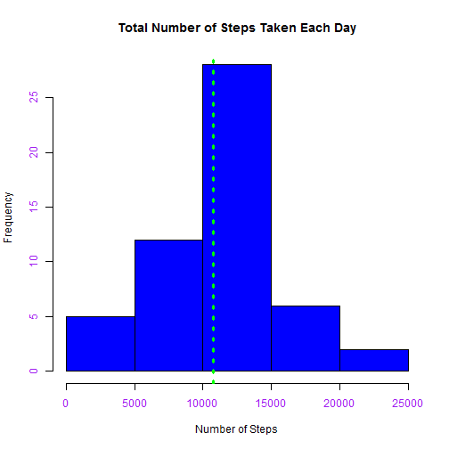
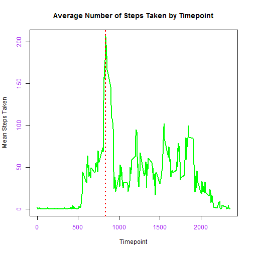
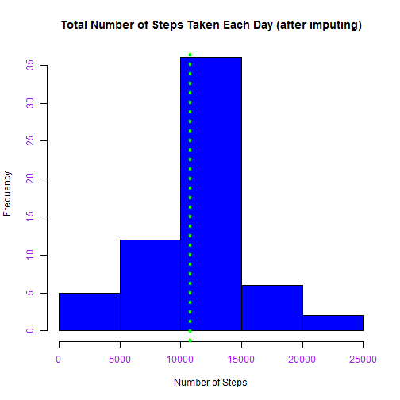
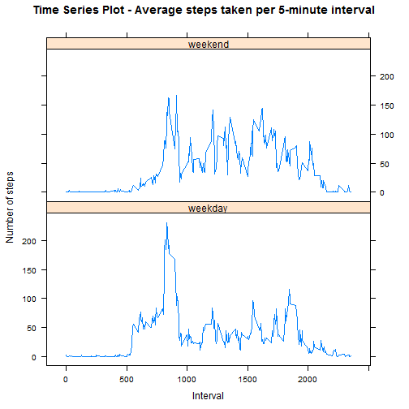

## Loading and preprocessing the data

Load the data from the working directory


```r
    activity<-read.csv("activity.csv",stringsAsFactors=F)
```

Format Date Column and remove 'NA' results


```r
    activity$date_formatted<-as.Date(activity$date,"%Y-%m-%d")
    
    activitysub<-activity[!is.na(activity$steps),]
```

## What is mean total number of steps taken per day?

Calculate total steps for each day, mean steps and median steps


```r
    dailysteps<-aggregate(steps~date_formatted,
                          FUN=sum,
                          data=activitysub)

    meansteps<-mean(dailysteps$steps)
    meanstepsr<-formatC(meansteps,6)
    mediansteps<-median(dailysteps$steps)
```

Plot histogram of Total Number of Steps Taken Each Day and report the mean and median total steps taken per day


```r
    hist(dailysteps$steps,
         col.axis="purple",
         main="Total Number of Steps Taken Each Day",
         xlab="Number of Steps",
         col="blue")

    abline(v=meansteps,
           col="green",
           lty=9,
           lwd=3)
```

 

###The mean steps taken per day is: 10766.2
###The median steps taken per day is: 10765

## What is the average daily activity pattern?

Calculate mean steps for each timepont


```r
tptmeans<-aggregate(steps~interval,
                     FUN=mean,
                     data=activitysub)

maxsteps<-tptmeans[tptmeans$steps == max(tptmeans$steps),]

maxint<-(maxsteps$interval)
```

Plot time series of the 5-minute interval (x-axis) and the average number of steps taken, averaged across all days (y-axis). Report the five minute interval on average across all the days in the dataset which contains the maximum number of steps


```r
plot(x=tptmeans$interval,
    y=tptmeans$steps,
    type='l',
    main="Average Number of Steps Taken by Timepoint",
    xlab="Timepoint",
    ylab="Mean Steps Taken",
    lwd=2,
    col="green",
    col.axis="purple")

abline(v=maxsteps$interval,
       col="red",
       lty=9,
       lwd=2)
```

 

###The five minute interval with the maximum number of steps is : 835


## Imputing missing values

Calculate the total number of missing values

Strategy for Imputing missing values:
Calculate mean steps for each timepont. Round the calculated mean to the nearest whole number as number of steps taken should be a whole number. Use the corresponding rounded value to fill in any missing values for each time point.

Calculate total steps for each day and the mean and median steps


```r
rowsmissing<-sum(!complete.cases(activity))

timepoint_means<-aggregate(steps~interval,
                     FUN=mean,
                     data=activity)

timepoint_means["steps_imputed"] <- round(timepoint_means$steps,digits=0)

timepoint_means<-timepoint_means[,c(1,3)]

activitytpt<- merge(activity,timepoint_means,by="interval")

activityimp=transform(activitytpt,steps = ifelse(is.na(steps),steps_imputed,steps))

    dailystepsimp<-aggregate(steps~date_formatted,
                            FUN=sum,
                            data=activityimp)
    
    meanstepsimp<-mean(dailystepsimp$steps)
    meanstepsimpr<-formatC(meanstepsimp,6)
    medianstepsimp<-formatC(median(dailystepsimp$steps),6)
```

Plot histogram of steps per day and report the mean and median total steps taken 


```r
    hist(dailystepsimp$steps,
         col.axis="purple",
         main="Total Number of Steps Taken Each Day (after imputing)",
         xlab="Number of Steps",
         col="blue")
    

abline(v=meanstepsimp,
       col="green",
       lty=9,
       lwd=3)
```

 

###Number of rows missing data is: 2304

###For data set with imputed values:
###The mean steps taken per day is: 10765.6
###The median steps taken per day is:   10762

Mean and Median values decrease when using rounded timepoint means for each timepoint to impute missing values

## Are there differences in activity patterns between weekdays and weekends?

Use weekday fuction to get day of the week for each date.
Split into weekday and weekend - create factor variable "wday"
Calculate means per day type and interval


```r
    wdaystrans<-transform(activityimp,weekday=weekdays(date_formatted))
    
    wdaysimp=transform(wdaystrans,wday = ifelse(wdaystrans$weekday %in% c("Saturday", "Sunday"),"weekend","weekday"))
    wdaysimp$wday<-as.factor(wdaysimp$wday)
    
    
    meanstepswday<-aggregate(steps~interval+wday,
                             FUN=mean,
                             data=wdaysimp)

    #maxsteps2<-meansteps2[meansteps2$steps == max(meansteps2$steps),]
```

Plot time series - create panel plot using lattice plotting system
5 minute interval is placed on the x-axis. Average steps taken on the y-axis
Divided into panel for weekdays and for weekend days


```r
    library(lattice)
    
    xyplot(steps~interval|wday,
            data=meanstepswday,
            layout=c(1,2),
            type="l",
            main="Time Series Plot - Average steps taken per 5-minute interval",
            xlab="Interval",
            ylab="Number of steps")
```

 
